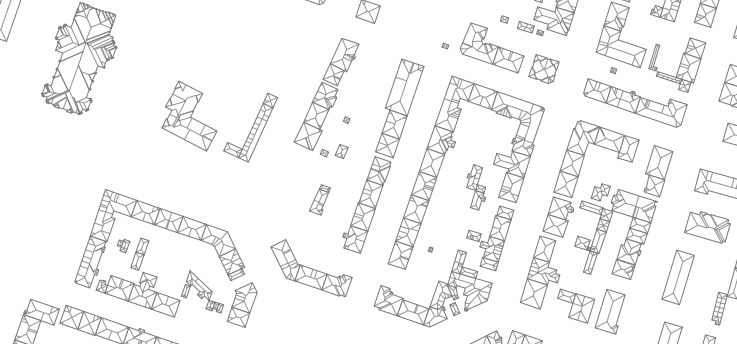

# shapely-polyskel

<p align="center">

</p>

> [!NOTE]
> This package is a fork of an implementation written by Ármin Scipiades (Botffy). The original code can be found under the [link](https://github.com/Botffy/polyskel).

This is a Python 3 implementation of the straight skeleton algorithm as described by Felkel and Obdržálek in their 1998 conference paper [Straight skeleton implementation](doc/StraightSkeletonImplementation.pdf).

The algorithm itself is fairly dated, and shown to be incorrect for certain input polygons.
This implementation is a bit crap, and does not really attempt to fix the algorithm.
It works kinda okay for most real-life input (for example country contours or floor plans).

For a modern and excellent overview of the topic please refer to Stefan Huber's excellent [Computing Straight Skeleton and Motorcycle Graphs: Theory and Practice](https://www.sthu.org/research/publications/files/phdthesis.pdf).

## Installation

shapely-polyskel is available on PyPI:

```bash
pip install shapely-polyskel
```

<!-- ## Usage

```python
from shapely_polyskel import skeletonize

rectangle = [(0, 0), (0, 20), (40, 20), (40, 0)]

straight_skeleton = skeletonize(florida_polygon)

# [Subtree(source=Point2(10.00, 10.00), height=10.0, sinks=[Point2(0.00, 0.00), Point2(0.00, 20.00)]), Subtree(source=Point2(30.00, 10.00), height=10.0, sinks=[Point2(10.00, 10.00), Point2(40.00, 20.00), Point2(40.00, 0.00)])]
``` -->

## Forks & ports

- [Yongha Hwang's fork](https://github.com/yonghah/polyskel). Check out it to see polyskel in [sweet real-life action](https://github.com/yonghah/polyskel/blob/master/Create%20layout%20network%20using%20straight%20skeletons%20.ipynb) :heart: :heart: :heart:.
- [Polyskel-Swift](https://github.com/andygeers/Polyskel-Swift) a Swift port.
- [bpolyskel](https://github.com/prochitecture/bpypolyskel) is a port for Blender, making [some sweet roofs](https://user-images.githubusercontent.com/613295/94917497-4fd8c800-04b9-11eb-89ba-2f4f47f5b416.png) :heart:.
